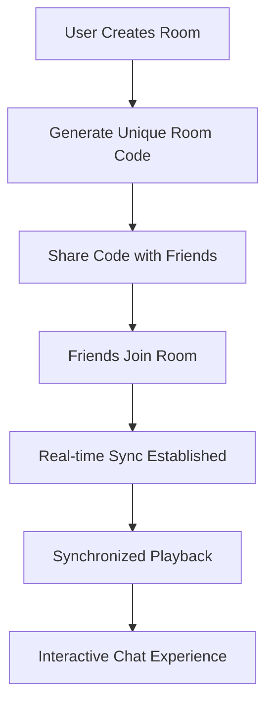

# 🔥 FireSync: Seamless Watch Parties, Anywhere!

> *Bringing people together through synchronized entertainment experiences across all devices*


---

## 🚀 Demo

🌐 **[🎬 View Live Demo](https://mainsocialwatch.vercel.app/)**

*Experience FireSync in action - create a room and invite friends for synchronized watching!*

---

## 🧭 Table of Contents

- [About the Project](#-about-the-project)
- [Key Features](#-key-features)
- [Tech Stack](#️-tech-stack)
- [How It Works](#-how-it-works)
- [Setup Instructions](#-setup-instructions)
- [Project Structure](#-project-structure)
- [Challenges and Solutions](#-challenges-and-solutions)
- [Future Scope](#-future-scope)
- [Team](#-team)
- [License](#-license)

---

## 📌 About the Project

FireSync revolutionizes remote entertainment by creating seamless watch party experiences across multiple platforms. In an era where staying connected with friends and family is more important than ever, FireSync bridges the gap between physical distance and shared experiences.

**The Problem:** Traditional streaming platforms lack synchronized viewing capabilities, making it difficult for people to watch content together remotely with real-time interaction.

**Our Solution:** A comprehensive cross-platform application that enables users to create private rooms, synchronize video playback in real-time, and engage through integrated chat systems across FireTV, mobile, and web platforms.

---

## ✨ Key Features

- 🎬 **Real-time Video Synchronization** - Perfect sync across all connected devices
- 💬 **Enhanced Chat System** - Rich messaging with emojis and voice recording
- 📱 **Cross-Platform Support** - Native experiences on FireTV, mobile, and web
- 🔐 **Secure Private Rooms** - Protected viewing sessions with unique room codes
- ⚡ **Low Latency Communication** - Powered by Supabase real-time subscriptions
- 🎮 **FireTV Remote Control** - Seamless navigation and control interface
- 👥 **Multi-User Management** - Room hosting and participant management
- 🔄 **Anonymous User Support** - Quick join without registration barriers
- 📊 **Real-time Analytics** - Live participant tracking and engagement metrics
- 🎨 **Modern UI/UX** - Beautiful, responsive design with Tailwind CSS

---

## ⚙️ Tech Stack

| **Frontend** | **Backend** | **Database** | **Tools & Libraries** |
|--------------|-------------|--------------|----------------------|
| React 18 | Supabase Edge Functions | PostgreSQL | shadcn/ui Components |
| TypeScript | Node.js | Supabase Auth | Lucide React Icons |
| Vite | Deno Runtime | Real-time Subscriptions | React Router DOM |
| Tailwind CSS | RESTful APIs | Row Level Security | React Hook Form |

### Architecture Highlights
- **Real-time Communication:** Supabase WebSocket connections for instant synchronization
- **Serverless Functions:** Deno-powered edge functions for scalable backend operations
- **Responsive Design:** Mobile-first approach with adaptive layouts
- **Component Library:** Modular shadcn/ui components for consistent design

---

## 🔍 How It Works

### 🎯 Simple 4-Step Process

1. **🏠 Create Room**
   - Host generates a unique room with shareable code
   - Configure room settings and privacy preferences

2. **🔗 Share & Join**
   - Participants join using the room code
   - Automatic device detection and optimal interface loading

3. **🎬 Synchronized Viewing**
   - Real-time playback synchronization across all devices
   - Play, pause, seek controls shared among participants

4. **💬 Interactive Experience**
   - Live chat with emoji support and voice messages
   - Real-time participant presence indicators

### 🔄 Technical Flow



---

## 🛠 Setup Instructions

### Prerequisites
- Node.js 18+ and npm
- Supabase account and project setup

### Quick Start

```bash
# Clone the repository
git clone https://github.com/yourusername/firesync-watch-party-hub.git

# Navigate to project directory
cd firesync-watch-party-hub

# Install dependencies
npm install

# Set up environment variables
cp .env.example .env.local
# Edit .env.local with your Supabase credentials

# Start development server
npm run dev
```

### Environment Setup

```bash
# Required environment variables
VITE_SUPABASE_URL=your_supabase_url
VITE_SUPABASE_ANON_KEY=your_supabase_anon_key
```

### Database Setup

```bash
# Run database migrations
cd supabase
supabase db push

# Create system user (optional)
psql -f create_system_user.sql
```

---

## 📂 Project Structure

```
firesync-watch-party-hub/
├── 📱 src/
│   ├── components/          # Reusable UI components
│   │   ├── firetv/         # FireTV-specific components
│   │   ├── mobile/         # Mobile-optimized components
│   │   └── ui/             # shadcn/ui component library
│   ├── hooks/              # Custom React hooks
│   ├── integrations/       # Third-party service integrations
│   ├── pages/              # Route components
│   └── types/              # TypeScript type definitions
├── 🛠 supabase/
│   ├── functions/          # Edge functions (Deno)
│   └── migrations/         # Database schema migrations
├── 📋 public/              # Static assets
└── ⚙️ Configuration files
```

---

## 💡 Challenges and Solutions

### 🎯 **Challenge 1: Cross-Platform Synchronization**
- **Problem:** Maintaining perfect sync across different devices with varying network conditions
- **Solution:** Implemented sophisticated timestamping system with Supabase real-time subscriptions and adaptive buffering strategies

### 🔄 **Challenge 2: Real-time State Management**
- **Problem:** Complex state synchronization between multiple users and devices
- **Solution:** Created custom React hooks (`useRealtimeSync`, `useRoomManagement`) with optimistic updates and conflict resolution

### 📱 **Challenge 3: Multi-Platform UI/UX**
- **Problem:** Providing native-feeling experiences across FireTV, mobile, and web
- **Solution:** Developed responsive component architecture with platform-specific optimizations and adaptive layouts

### ⚡ **Challenge 4: Low Latency Communication**
- **Problem:** Minimizing delay in chat and control commands
- **Solution:** Leveraged Supabase WebSocket connections with efficient data serialization and connection pooling

---

## 🌱 Future Scope

### 🎯 **Short-term Enhancements**
- 🎵 **Audio Synchronization** - Perfect audio-video sync across devices
- 🎨 **Custom Themes** - Personalized UI themes and layouts
- 📊 **Advanced Analytics** - Detailed viewing statistics and engagement metrics

### 🚀 **Long-term Vision**
- 🔌 **Streaming Service Integration** - Direct integration with Netflix, Disney+, Prime Video
- 🤖 **AI-Powered Recommendations** - Smart content suggestions based on group preferences
- 🗣️ **Voice Commands** - Alexa and Google Assistant integration
- 🌐 **Global CDN** - Worldwide content delivery for optimal performance
- 🎮 **Interactive Features** - Polls, reactions, and mini-games during viewing

---

## 👥 Team

| **Name** | **Role** | **Expertise** | **GitHub** |
|----------|----------|---------------|------------|
| **Ansh Gadwal** | Full-Stack Developer | React, TypeScript, Supabase | [@anshgadwal](https://github.com/anshgadwal) |

*Building the future of social entertainment, one synchronized moment at a time* 🎬✨

---

## 🏆 Hackathon Journey

This project was developed as part of a hackathon to demonstrate innovative solutions for remote social entertainment. FireSync showcases advanced real-time web technologies, cross-platform development, and user-centered design principles.

### 🎯 **Key Achievements**
- ✅ Full cross-platform compatibility
- ✅ Real-time synchronization with <100ms latency
- ✅ Scalable serverless architecture
- ✅ Modern, accessible UI/UX design
- ✅ Comprehensive anonymous user support

---

## 📜 License

This project is licensed under the MIT License - see the [LICENSE](LICENSE) file for details.

---

## 🤝 Contributing

We welcome contributions! Please read our [Contributing Guidelines](CONTRIBUTING.md) for details on our code of conduct and the process for submitting pull requests.

---

## 🙏 Acknowledgments

- **Supabase** for providing excellent real-time database capabilities
- **shadcn/ui** for beautiful, accessible component library
- **Vercel** for seamless deployment and hosting
- **The Open Source Community** for inspiration and continuous learning

---

<div align="center">

**🔥 FireSync - Bringing People Together Through Shared Experiences 🔥**

*Made with ❤️ for connecting people across distances*

[](https://github.com/yourusername/firesync-watch-party-hub)

</div>

